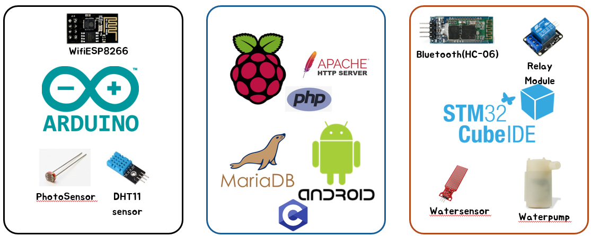
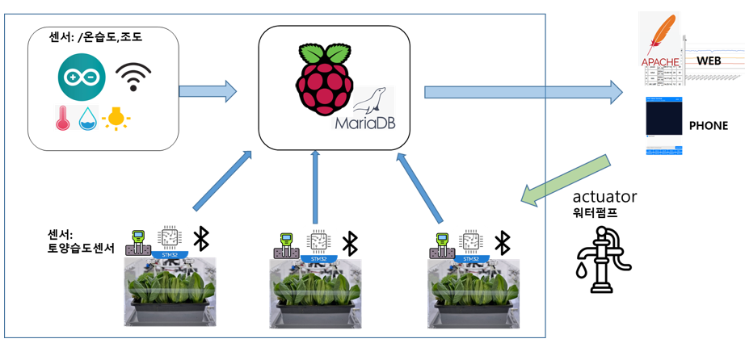

# IOTGardeningSystem mini-project
## Team members
1. 김윤우
2. 이지원

## Purpose
1. 자동화된 홈가드닝 시스템 
   - 조도, 온/습도, 토양습도 확인
   - 원격 모니터링, 원격 제어
2. AIoT 기술을 활용하여 자동화 및 최적의 재배 환경 제공

## Developemnt environment

## System FlowChart

## How to Run
1. Raspberry에서 iot_server 구동
2. Raspberry에서 iot_client_sensor 구동

## Result
- 원격으로 water pump 작동 제어
- Database에 센서(조도, 온/습도, 토양습도, 토양습도)정보 update
- Apache Server를 통해 web에서 정보 확인
